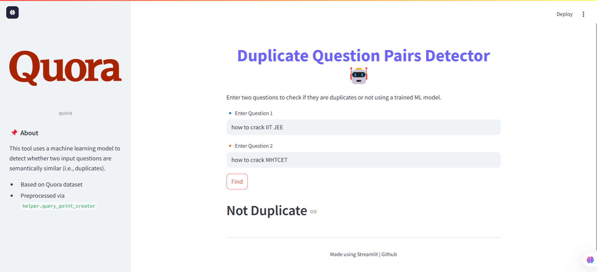

# Quora Duplicate Question Pairs Detector



## 🔍 Overview

This Streamlit web application predicts whether two questions from Quora are duplicates, aiming to reduce redundancy and enhance user experience on Q&A platforms. By leveraging Natural Language Processing (NLP) techniques and machine learning models, the app provides real-time predictions on question similarity.

## 🧠 Features

- *User-Friendly Interface*: Input two questions and receive instant feedback on their similarity.  
- *Preprocessing Pipeline*: Includes text cleaning, stopword removal, and vectorization using Bag of Words (BoW).  
- *Machine Learning Model*: Utilizes a trained model (e.g., Logistic Regression) to predict duplicate questions.  

## 🗂 Project Structure


├── app.py                 # Main Streamlit application  
├── helper.py              # Helper functions for preprocessing  
├── model.pkl              # Trained ML model  
├── cv.pkl                 # CountVectorizer object  
├── stopwords.pkl          # List of stopwords  
├── requirements.txt       # Python dependencies  
└── README.md              # Project documentation  


## 🚀 Getting Started

### Prerequisites

- Python 3.7 or higher  
- pip (Python package installer)  

### Installation & Setup

1. **Clone the repository**:
   ```bash
   https://github.com/Vedantvijayhumbe/Quora-Duplicate-Question-Pairs-Detector.git
   ```
2. **Navigate to the project directory**:
   ```bash
   cd Quora-Duplicate-Question-Pairs-Detector 
   ```
3. **Create a virtual environment (optional but recommended)**:
   ```bash
   python -m venv .venv
   ```
4. **Activate the virtual environment**:
   - **Windows**:
     ```bash
     venv\Scripts\activate
     ```
   - **Mac/Linux**:
     ```bash
     source venv/bin/activate
     ```
5. **Install the required dependencies**:
   ```bash
   pip install -r requirements.txt
   ```

### Running the Application

After installation, follow these steps to run the project:

1. **Start the application**:
   ```bash
   streamlit run app.py
   ```
2. Open your browser and go to:
   ```
   https://127.0.0.1:5000/
   ```
   (or the address displayed in your terminal)

## 📈 Model Details

- *Vectorization*: Bag of Words (BoW) using CountVectorizer  
- *Model*: Logistic Regression trained on preprocessed question pairs  
- *Evaluation Metric*: Accuracy score on a validation set  

## 🛠 Future Enhancements

1. *Advanced Text Representations*  
   - Implement Word2Vec or GloVe embeddings  
   - Use TF-IDF to weigh terms based on importance  

2. *Deep Learning Models*  
   - Explore Siamese Networks for similarity learning  
   - Implement LSTM/GRU for sequence modeling  

3. *Enhanced Evaluation Metrics*  
   - Use Log Loss, Precision, Recall, and F1-Score  

4. *Data Augmentation*  
   - Use paraphrasing and back-translation  

5. *Deployment Improvements*  
   - Dockerize the app  
   - Add CI/CD for automation  

## 📚 References

- [Quora Question Pairs Dataset on Kaggle](https://www.kaggle.com/datasets/vennela18/quora-question-pairs-train)  
- [End-to-End NLP Project on Quora Duplicate Questions](https://www.analyticsvidhya.com/blog/2023/04/end-to-end-nlp-project-on-quora-duplicate-questions-pair-identification/)  
- [Stanford CS224n Report](https://web.stanford.edu/class/archive/cs/cs224n/cs224n.1174/reports/2759336.pdf)

## 🤝 Contributing

Contributions are welcome! Please fork the repository and submit a pull request for any enhancements or bug fixes.
